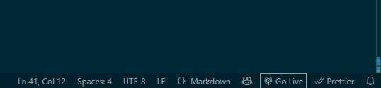
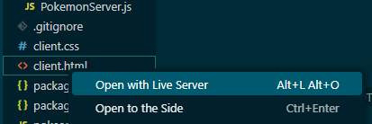

# 8510-final-project

### file descriptions
```
📦 
├─ .gitignore - for ignoring config files and the like
├─ README.md - what you're reading right now
├─ client.css - for adding style elements
├─ client.html - landing page
├─ img
│  └─ Pokeball.png - static image we load if there are issues loading a pokemon images
├─ models
│  └─ gesture_recognizer.task - MediaPipe model weights
├─ package-lock.json - JS installation information, for reproducibility
├─ package.json - JS installation information, for reproducibility
├─ pokeapi-js-wrapper-sw.js - wrapper for an API used to fetch pokemon images
├─ scripts - tests scripts that are not part of the final project
│  ├─ battle-helper.js
│  ├─ battle.js
│  └─ constants.js
└─ src
   ├─ HUDStateMachine.js - state machine used to control UI presentation/user interaction
   ├─ Helper.js - helper functions/constants
   ├─ PokemonClient.js - main entry point for client code
   ├─ PokemonServer.js - code for server used to drive backend of the project
   └─ states - used for controlling the state machine for UI presentation/user interaction
      ├─ BattleOverState.js
      ├─ BattleShowState.js
      ├─ BattleWaitingState.js
      └─ UserConfirmationState.js
```
©generated by [Project Tree Generator](https://woochanleee.github.io/project-tree-generator)

### Instructions for running our project

Note that this project was completed on Node version 22.15.0, and will require running `npm install` in order to download the dependencies `package.json`, as well as the capability to run VS Codes Live Server extension, or a similar utility.

1. Download repository from Github
2. Run `npm install` from within the repo
3. On one terminal, run `node src/PokemonServer.js`.
4. Activate the Live Server by clicking on the "Go Live" button (after installing VS Code Live Server extension).



5. Right click on `client.html` and choose the "Open with Live Server" option, or go to a web browser and navigate to http://localhost:5500/client.html. (Note that the port number may be different if Live Server starts on a different port).



6. You should be able to start interacting with the application. Two thumbs from the users are required in order to start the battle. If there are any failures that cause unresponsiveness, or you would like to restart the application then do these steps again from step 3.